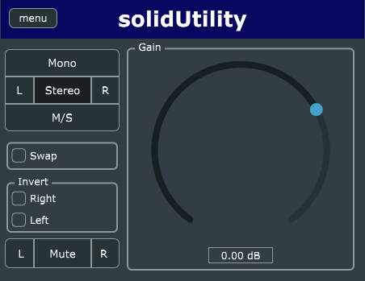

# solidUtility

Versatile VST3 Channel Utility for Digital Audio Workstations.

solidUtility can swap channels, mute channels, do mid-side encoding and decoding, phase invert and more!



## Using

See the [User Manual](docs/USER_MANUAL.md).

## Installing

Please see the [Installation Guide](docs/INSTALLATION_GUIDE.md)

## Building

Build works for Windows, Linux, and MacOS. 

```sh
git clone https://github.com/SolidFuel/Utility.git
cd Utility

cmake -S. -Bbuild -DCMAKE_BUILD_TYPE=Release
cmake --build build --config Release
```

## Technology

- [JUCE](https://juce.com/)

## License/Copyright

solidUtility - Versatile VST3 Channel Utility (C) 2023 Solid Fuel

This program is free software: you can redistribute it and/or modify it under
the terms of the **GNU General Public License** as published by the Free
Software Foundation, either version 3 of the License, or (at your option) any
later version. This program is distributed in the hope that it will be useful,
but WITHOUT ANY WARRANTY; without even the implied warranty of MERCHANTABILITY
or FITNESS FOR A PARTICULAR PURPOSE.

See [the license file](LICENSE) for more details.
