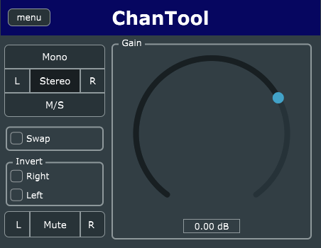

# ChanTool

Versatile VST3 Channel Utility for Digital Audio Workstations



## Using

See the [User Manual](docs/USER_MANUAL.md).

## Building

Build should work for Windows and Linux. There is tooling for MacOS, but I don't
think it works.

```sh
git clone https://github.com/SolidFuel/ChanTool.git
cd ChanTool
cmake -S. -Bbuild
cmake --build build
```

## Install From Release

These instructions assume you are installing from the provided release builds.
If you build it yourself, the instruction will be similar. The needed files will
under the `${BUILD}/Source/ChanTool_artefacts/Release/VST3`

### Windows

_Note_ The release builds only work on 64bit windows.

Unzip the file ChanTool-win-vx.x.x.zip. Place the resulting `ChanTool.vst3` file into
`C:\Program Files\Common Files\VST3`

### Linux

_Note_ The release builds only work on x86_64 architecture.

Unzip the file ChanTool-linux-vx.x.x.zip. Place the resulting `ChanTool.vst3`
directory into `~/.vst3`

This can also be placed in `/usr/local/lib/vst3` for system-wide use. You will
need superuser privileges to do so.

### MacOS

Work in Progress

## Technology

- [JUCE](https://juce.com/)

## License/Copyright

ChanTool - Simple DAW Channel Utility (C) 2023 Sulid Fuel

This program is free software: you can redistribute it and/or modify it under
the terms of the **GNU General Public License** as published by the Free
Software Foundation, either version 3 of the License, or (at your option) any
later version. This program is distributed in the hope that it will be useful,
but WITHOUT ANY WARRANTY; without even the implied warranty of MERCHANTABILITY
or FITNESS FOR A PARTICULAR PURPOSE.

See [the license file](LICENSE) for more details.
