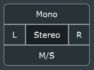

# solidUtility _V0.3.0_

solidUtility is a versatile channel utility plug-in for Digital Audio Workstations.
It is compatible with all DAWs that support the VST3 plug-in format.

It is currently supported on Windows 64 bit platforms and all Linux 64 bit distributions.

This user's manual will walk you through each of the controls on the _solidUtility_ interface.

## Header

The `menu` button on the left contains the `about` menu option to display
version, copyright, and other information about the software.

## Main Controls

### Channel Mode

This set of controls allows you to configure what information is output.
This may then be further modified by the other controls.

- Mono : Sums the two input channels a places that sum on both outputs.
- Stereo : 'Normal mode' THe left input is placed on the left output and the 
  right input is placed on the right output.
- Left : (Labelled 'L'). The **left** input is copied to both the left and the right outputs.
- Right : (Labelled 'R'). The **right** input is copied to both the left and the right outputs.
- M/S : Mid-side mode. The mid channel is place on the left output and side channel is placed
  on the right output.

### Swap

Sends the left input to the right output and the right input to the left output.

### Invert

Switches the polarity of the input signal.

### Mute

Mute one or both outputs. Only one of the selections can be active.
Clicking on an active button will turn it off.

- Mute : Mute both outputs.
- Left : (Labelled 'L') Mute the left output.
- Right : (Labelled 'R' ) Mute the right output.

### Gain

The gain knob sets the overall gain of the output.

It can be controlled by clicking in the box and dragging up and down.
There is fine adjustment mode available if you hold Cmd/Ctrl while dragging.

You can also click in the text box and type in a specific value.

## Signal Flow

The signal flows through the controls in the following order (mostly top-to-bottom):

- Channel Mode selector
- Swap
- Invert
- Gain
- Mute

## Appendix

### Host Automatable parameters

This table gives the names of the paramters that _solidUtility_ makes available
to the host and which control on the UI it corresponds to.

|Parameter Name|UI Control|
|---|---|
|Gain| The Gain knob|
|InvertL| The "Left" checkbox in the Invert group|
|InvertR| The "Right" checkbox in the Invert group|
|Mute| The Mute Selector button set|
|Stereo Mode| The Channel Mode Selector|
|Swap| The Swap checkbox|
